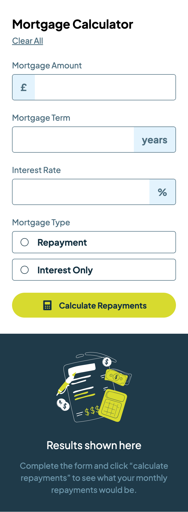
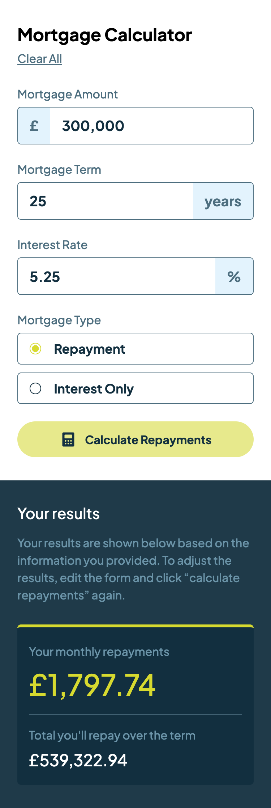
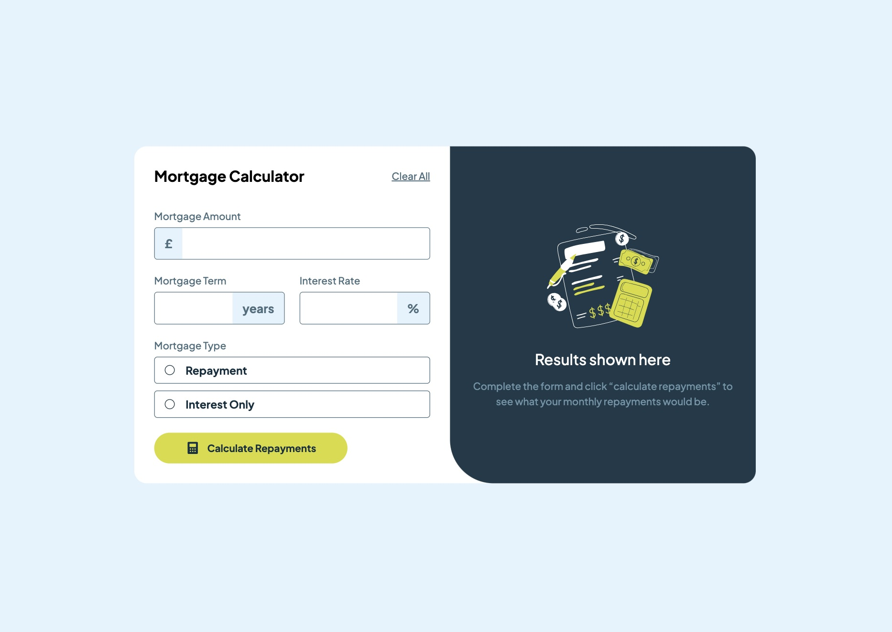
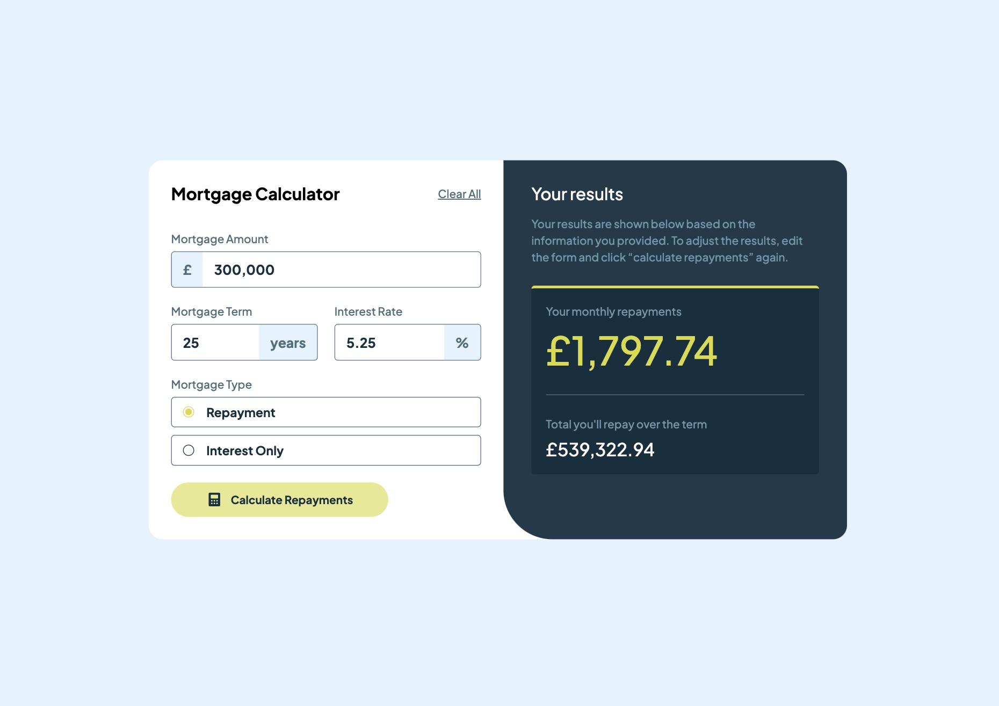
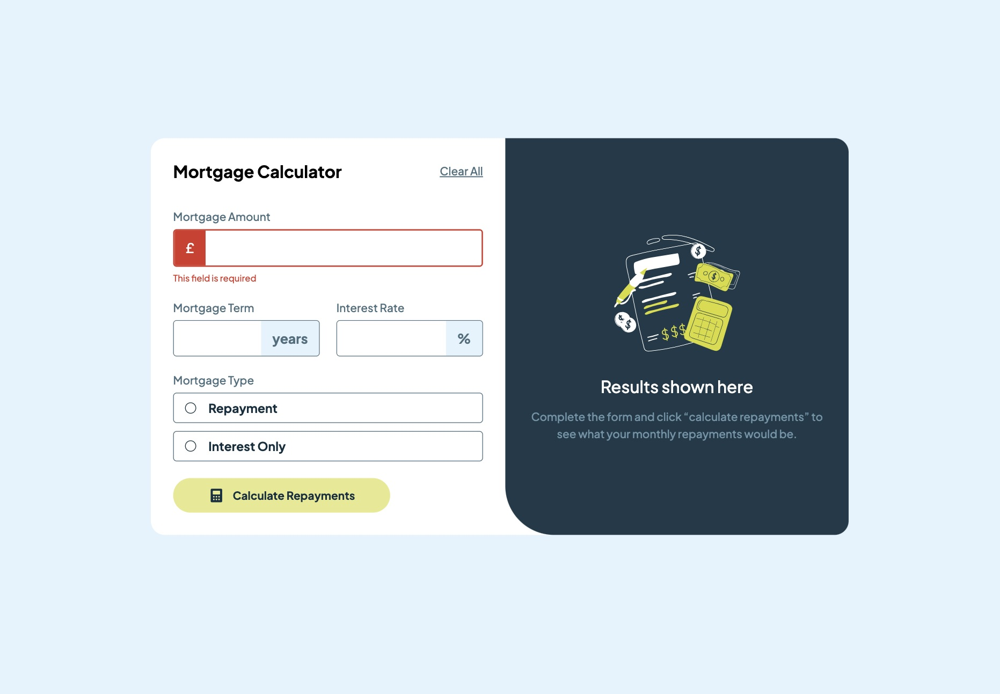

# Frontend Mentor - Mortgage repayment calculator solution

This is a solution to the [Mortgage repayment calculator challenge on Frontend Mentor](https://www.frontendmentor.io/challenges/mortgage-repayment-calculator-Galx1LXK73). Frontend Mentor challenges help you improve your coding skills by building realistic projects. 

## Table of contents

- [Overview](#overview)
  - [The challenge](#the-challenge)
  - [Screenshot](#screenshot)
  - [Links](#links)
- [My process](#my-process)
  - [Built with](#built-with)
  - [What I learned](#what-i-learned)
  - [Continued development](#continued-development)

## Overview

### The challenge

Users should be able to:

- Input mortgage information and see monthly repayment and total repayment amounts after submitting the form
- See form validation messages if any field is incomplete
- Complete the form only using their keyboard
- View the optimal layout for the interface depending on their device's screen size
- See hover and focus states for all interactive elements on the page

### Screenshot







### Links

- Solution URL: [React](https://github.com/Ayako-Yokoe/mortgage-repayment-calculator-main)
- Live Site URL: [Vercel](https://mortgage-repayment-calculator-main-nu.vercel.app/)

## My process

### Built with

- Semantic HTML5 markup
- CSS custom properties
- Flexbox
- Mobile-first workflow
- [React](https://reactjs.org/) - JS library

### What I learned

I learned how to create a form and add validation to it using React.
I'm still learning how to efficiently refactor similar features without repetition.

```js
const handleAmountValidation = (value) => {
  setInputAmount(value);

  const { isValid, parsedValue, error } = validateField({
    value, 
    min: 1
  })

  setIsAmountValid(isValid);
  setAmtErrorMessage(error);

  if (isValid) {
    setIsAmountValid(true);
    setMortgageAmt(parsedValue);
  }
}

```

### Continued development

There is a lot of repetition. To achieve DRY, I'll continue learning state management and form validation in React.
# mortgage-repayment-calculator-main
